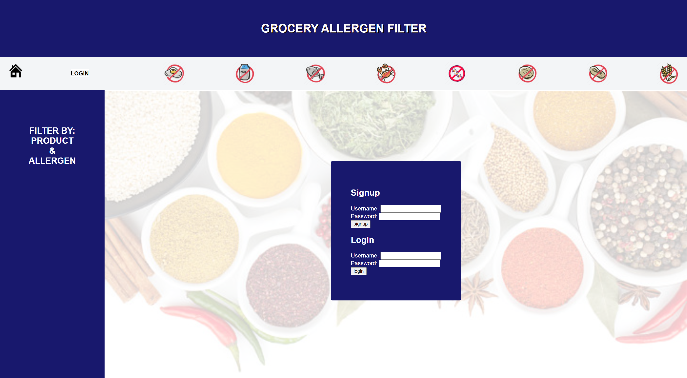
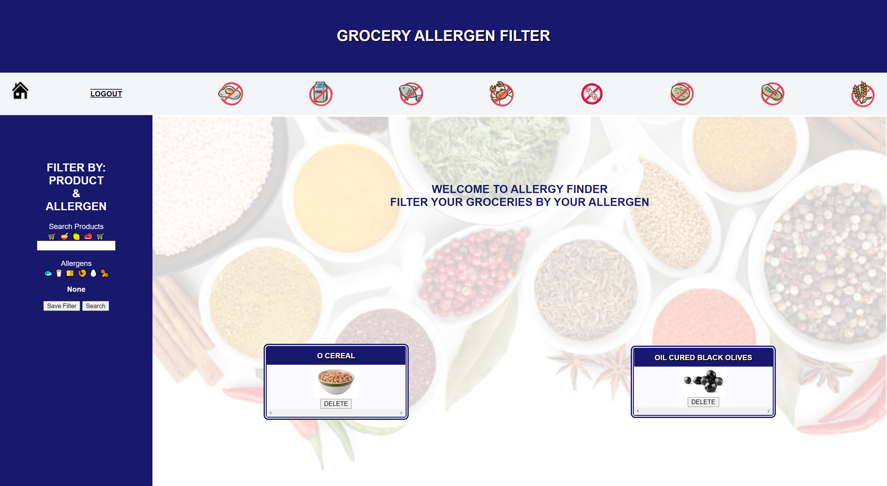
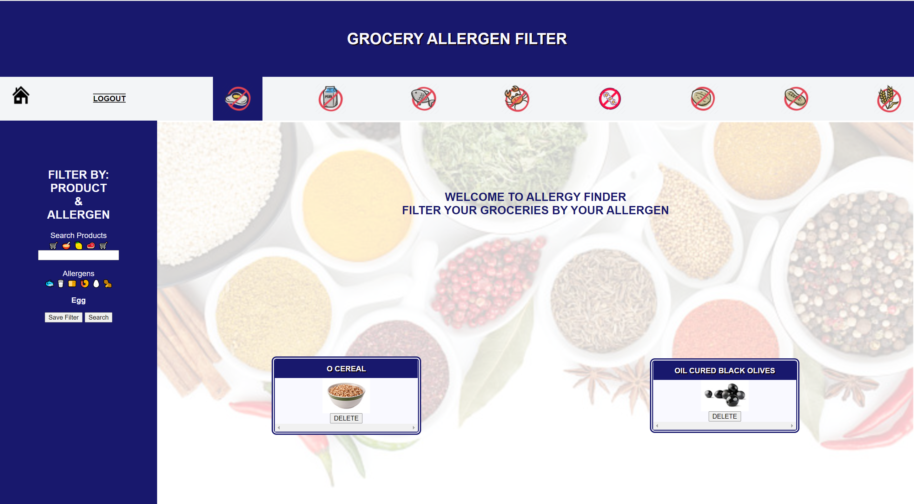
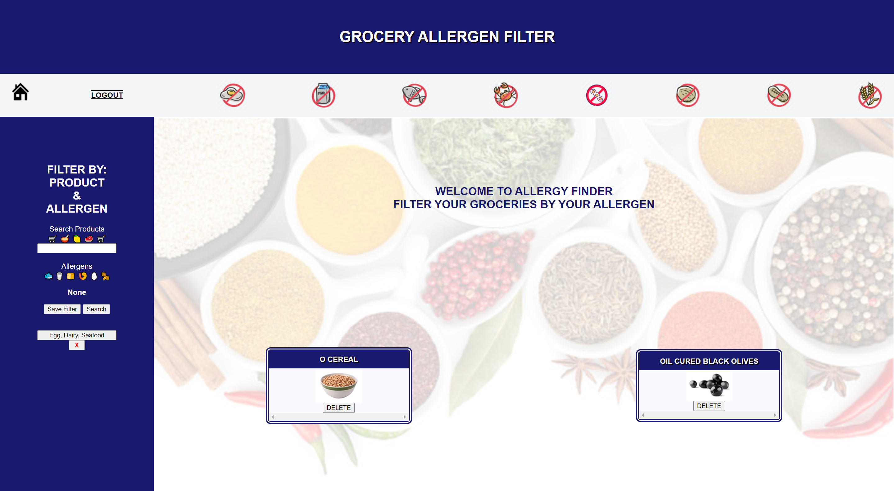
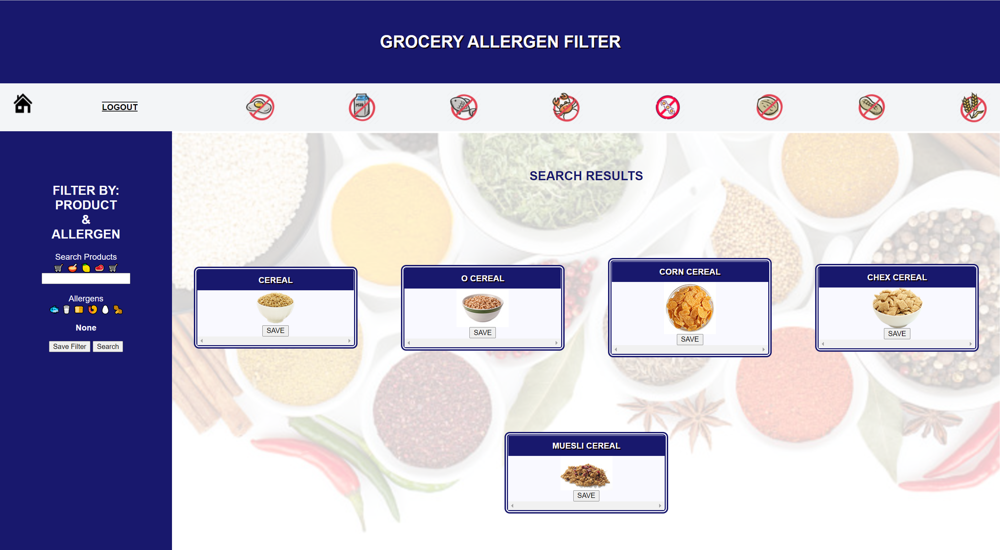
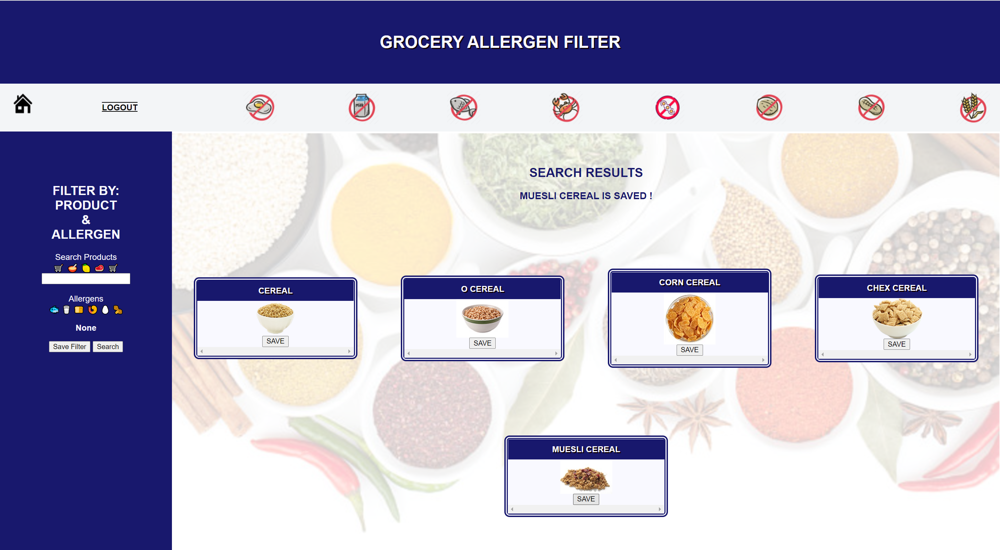
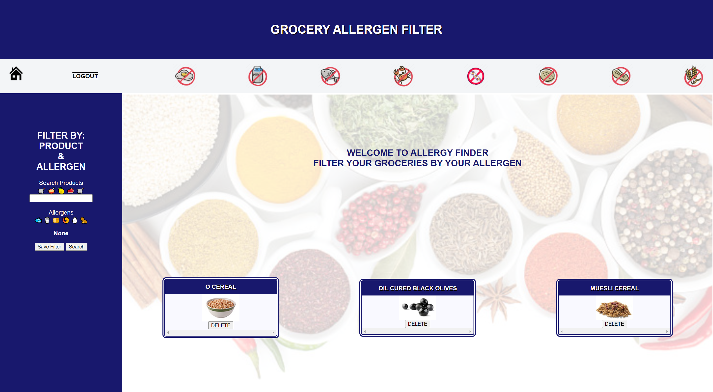
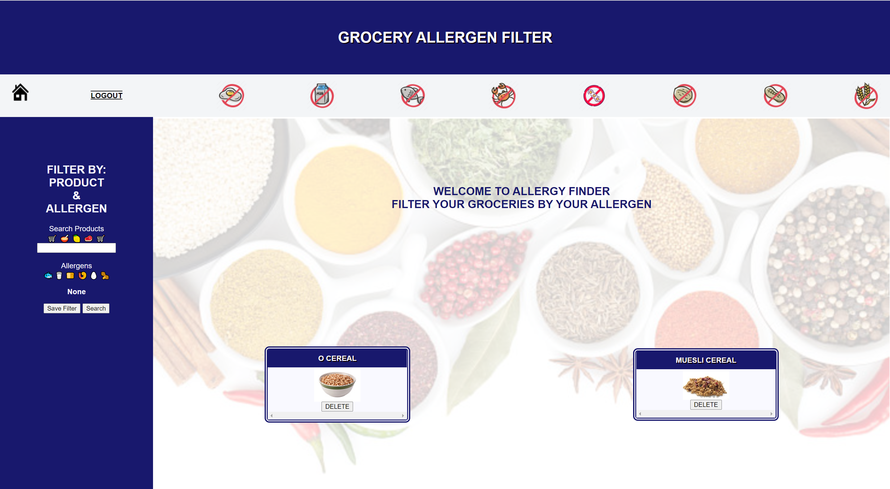

# Allergen Filter

## Description
 A user-friendly allergen filtered grocery application created for those who struggled with finding grocery products excluding their allergies 
 
## Table of Contents
* [Technology](#Technology)
* [Installation](#Installation)
* [Usage](#Usage)
* [Credits](#Credits)
* [Tests](#Tests)
* [Questions](#Questions)
* [License](#License)

## Technology
 * node.js
 * express.js
 * handlebars.js
 * mysql
 * Rapid Api - Spoonacular
 * Sequelize

## Installation
 1. clone github 
 2. npm install all required dependencies

## Usage
When users open the app, they will be presented the login page. Users will either signup or login to the app.
 
After users logged in, they will be presented the homepage.
The homepage will display a welcome message, all saved items for the user, a searching form on the left.
Also, the eight icons on the top are not activated.

By clicking on 1 of the 8 icons on top, user can add 1 of the 8 major allergens to the filter. 
User can click the icon again to take that off the filter.
 
Multiple allergens can be added to the filter. 
By clicking "Save Filter" button, the app will save the filter, and two buttons will add on.
One is for reapplying the filter to the search form. The other is for deleting the saved filter.
 
After user enter the product, setup the filter and hit the search button, user will be redirect to Search Result Page.
User will be presented with products that fit the searching credentials.

User can also click on the save button to save the corresponding product. A message will display to notify user item is saved. 
 
User can go back to HomePage by clicking on the Home Icon. The Home Page will display the updated saved items.

User can click on the delete button to delete the corresponding saved item.
   

## Credits
Jeffrey Banh : https://github.com/JeffreyBanh
Calvin Yan : https://github.com/pc611652003
Danika Pearson : https://github.com/karmadog72

David : Spoonacular - https://rapidapi.com/spoonacular/api/recipe-food-nutrition/

## Questions
Github : https://github.com/pc611652003/Allergy-Finder
Heroku : https://whispering-chamber-78611.herokuapp.com/

## License
 This repository is released under the [MIT License](https://opensource.org/licenses/MIT)
